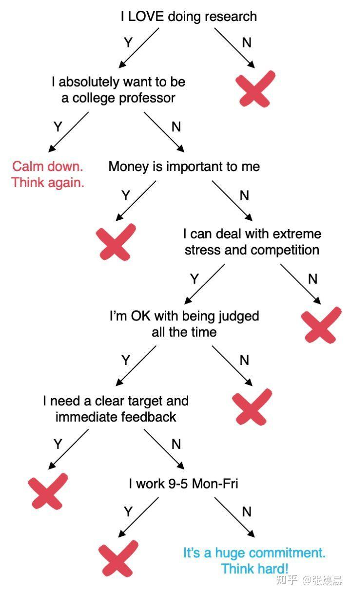
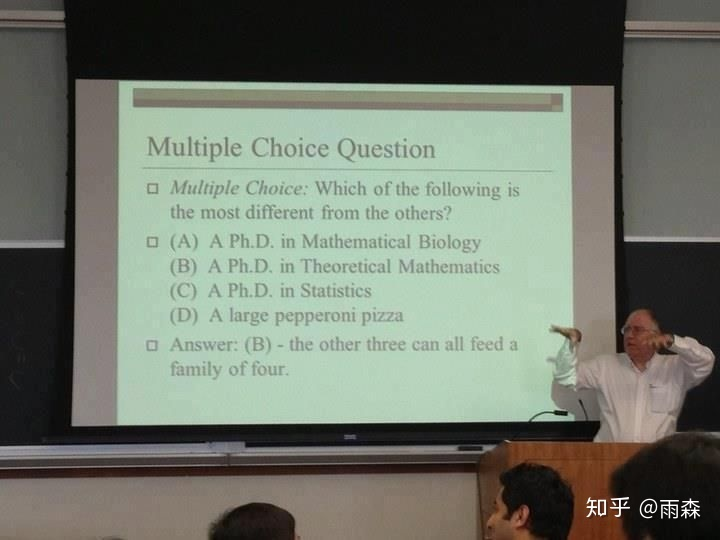

# 一些关于PhD的理解误区

笔者在跟一些学弟学妹进行交流的时候，发现很多学弟学妹对读博存在非常严重的误区。这里笔者们就用自己的想法给大家纠正一些PhD的理解误区。在这里先放一张知乎上找来的图，可能略有些绝对，但大家可以对照自查一下。

## 读博和读硕读本科没有区别，都是读书嘛

有的同学会觉得读博和读硕读本科没有什么区别，都是读书。

实际上，区别可大了。硕士和本科期间，主要的功夫是在上课，而博士期间，我们主要的功夫是在做科研。硕士和本科我们所做的往往是learn前人已经探索过的知识和领域，而博士我们所作的往往是自己探索新的知识和领域。
一言概之，硕士和本科我们在做的是一种“study”，而博士期间我们更像是在“work”，尤其是在欧陆，PhD更是被强调为一种“paid job”。也就是说读博并不是广义上的“读书”的范畴了。

## 我读完博肯定能当教授

这个是最严重的误区。

每年毕业的PhD数量对于教授职位缺口来说是稳稳地供大于求，前有武汉大学3%博士后转正率，后有中山大学几千号人“人才济济”卷教职。
也就是说并不是读完博就能当教授，如果非要卷教职，那要接受至少三年的考核期，如果期间没有成功转正被迫继续卷或者流落业界，对个人的前途乃至于精神压力是非常重的。

## 读博不是不累，甚至很轻松，是wlb（work-life-balance）

这个得分情况其实。

在欧洲的学校，一般读PhD是比较轻松的，老板普遍不push，也不会催进度，大部分情况下CS PhD可以很开心很悠闲的读完。

但是在欧洲以外的亚洲和美国读博，情况则非常不一样了。

* 前面说过了，PhD实际上是一份“paid job”，那么作为给你payment的老板，实际上是非常希望你能快点出成果，因此首先老板会push你。
* 进一步的，CS PhD是需要做“新的东西”的，也就是说需要比前人的工作“更好”。而计算机领域的技术进步是非常快的，可能你上个月好不容易想到的idea，一个月前被人想到了，抢先发论文投了，就没了，因此需要不断学的新东西，避免被落下。
* 部分领域的CS PhD需要做大量的Engineering工作（比如说System类），这就导致有非常多的heavy work需要完成，没有办法过的很悠闲。
* 一些CS PhD需要被迫做一些横向课题，进一步导致了wlb的失去（哭）。

## 找了教职就能（在国内）躺平了

如果说你对躺平的标准比较低，一个月四五千在一个二线城市（没错，我说的是杭州）的一般一本学校，而且不指望自己出什么好的成果，那确实够了。但是更多情况下，你要为了你的绩效工资而努力，为了招生指标而努力。那么这些东西从哪儿来呢？最直接的两样，就是文章和项目。文章可能比较好说，有idea，有人做，就能出（如果没有学生自己做的话，建议参考读博的生活）。但项目这个事儿就不好说了，写申报书，谈合作，找关系等等，都不像是躺平能解决的。说实话，这个东西并不是国内特有的，放眼全球，如果自己领导一个实验室，都免不了拉项目，申基金等。但如果只是挂在别人的大实验室下，躺不躺平很多情况下就由不得自己了。

很多人可能觉得高校老师会有很多隐形收入，我们抛开子女入学这种不能变现的不谈，剩下的，哪一项不用靠项目和论文换？没有项目和论文，约等于这个老师没有任何价值，那哪来的隐形收入？

## 读完博能挣大钱（去工业界和学术界都能挣打钱）

很多同学都认为读完博就是能挣打钱，能比本科和硕士就业的同学挣钱多很多。实际上这是不对的（或者说不完全对）。

首先从工业界来说：

第一点，就业薪酬这个问题具有非常大的随机性，根据自己本身水平+市场环境等有非常大的变动。并不是说读完博就一定比本科硕士挣得多，万一博士方向刚好这两年在市场非常冷门呢？

第二点，对企业而言，招博士生和硕士生的不同并不在于学位的不同，而在于博士生和硕士生学到的东西的不同。企业希望的是博士生能够做出具有影响力、前景和有一定引领性的工作。而博士生能做出这些工作的前提是自己在博士期间的科研训练和已经做出来的工作的基础。而如果博士期间只是一天到晚做横向，而没有收到比较硬核的科研训练的话，学术能力相对硕士生没有特别大的优势，而工程能力相对已经工作了几年的硕士本科同学也不一定有什么优势，这样毕业后还真不一定比本科硕士同学挣得多。

然后从学术界来说：

## 直博去不了top名校，可以读个ms当跳板去

很多同学会保有自己拿ms当跳板去申PhD的想法，诚然是有不少同学顺着这条路去到了top学校读PhD，但是实际上大部分读ms同学都没有能跳去更好学校，基于以下种种原因：

* ms申PhD是比本科申PhD的要求要高的，如果ms期间没有特别好的提升，甚至还不如本科直接申请PhD的结果好
* 热门方向，比如AI，是越来越卷的，甚至有ms期间就算卷出了成果，还没有同年申请的本科生pub强的可能性存在
* 很多人读ms期间看到周围读ms后就业去赚钱的同学眼红，直接ms毕业去工业界了
* 很多人读授课型硕士，并不一定有时间做研究，而部分学校可能更看重研究经历，因而花费的这些时间不一定能够有效弥补自己的短板

## 我对科研不排斥，但也不是很有兴趣，我适合读博吗？

笔者建议这类同学三思。兴趣是人持续干一件枯燥乏味的事的一大动力。在研究过程中，一两年没有成果，进展等，甚至陷入迷茫、自我怀疑，我觉得都是正常的。这时候需要有一个信念支撑自己继续走下去。“我一定要拿一个PhD学位”是一种信念，“我喜欢这个研究”也是另一种信念，但不同的信念会导致你做出不同的决定，虽然都能把你从这个困局中救出来，但接下来走向何方就不好说了。
