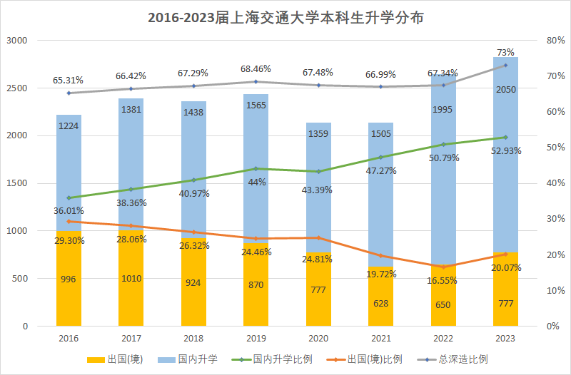
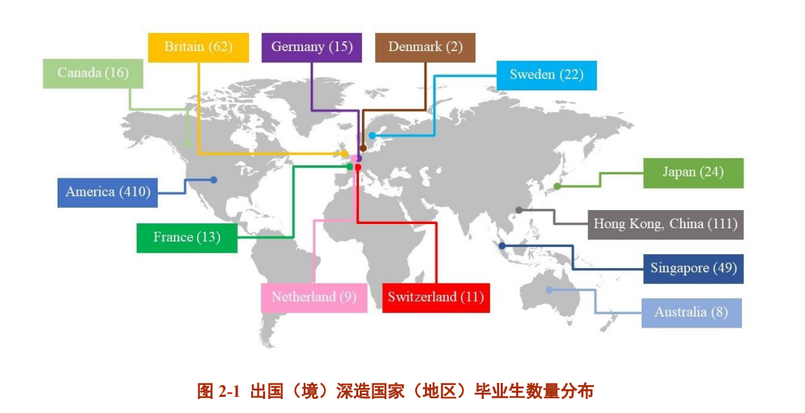

# 疫情后的留学新常态

在旧版生存手册写就的2008年，出国深造还是一个相对小众的选择，随着中国经济的腾飞，越来越多的中产家庭能够负担起海外留学费用，以及在08-09金融危机之后海外高校财政紧张需要扩招国际生增加收入，由下表可以看出此后中国留学生数量进入了快速增长的十年，越来越多的家庭甚至会把孩子送到海外就读高中本科。

但COVID-19以来给世界各行各业都带来了巨大冲击，当中国历经数月成功控制疫情后，主要的留学目标国家包括欧美加等国家地区疫情迟迟难以控制住，2020届本应秋季入学的同学不得不选择defer入学或者支付高额学费在Zoom上隔着几个小时时差上网课，难以跟老师和同学们近距离交流互动，也有相当一部分同学在国内大学推出的保研政策下放弃国外大学的录取转入本科学校继续深造。放弃出国的同学担心有很多，比如疫情的不确定性、签证难以申请、国际关系的紧张、机票难买、通航政策不明朗、国外当地人对留学生是否存在偏见、觉得网课形式浪费钱，没有实体体验好等等。

更复杂的因素是中国崛起的过程中，中美之间的博弈也加深了中国留学生在美国读书、职业发展的安全疑虑，从以往的交大毕业生统计数据来看，选择美国留学的比例占留学总人数的60%左右。加之国内高校近20年的飞速发展，近五年交大本科毕业生选择国内深造的比例持续升高，与此同时选择出国\(境\)深造的比例持续下滑，2022届交大本科生出国率下滑至16%，国内的顶尖高校如清华大学2020届本科生出国率已经下降到15%且未来继续下滑的势头未减。另一方面随着就业竞争越发激烈，保研名额的数量也在波动，作为就业蓄水池的“深造”选项的人数也不断上升。对于刚入学不久的大一大二同学来说，提早想清楚未来是直接就业还是深造，去哪深造对自身长远的发展大有裨益。

